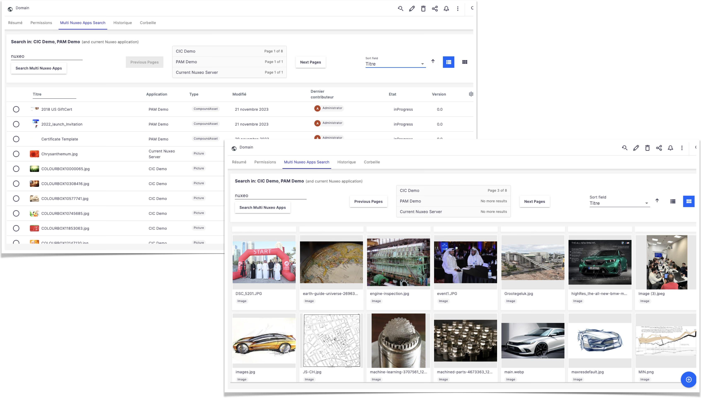

# nuxeo-labs-multi-nuxeoapps

Performs a search in multiple other Nuxeo applications.

## Searching Multiple Nuxeo Applications

The plugin allows for executing the same search (either NXQL or a page provider) accross as many distant Nuxeo applications as contributed to the `MultiNuxeoAppService` service. The result of the search is a JSON array of entity-type `"documents"`, one per configured application plus the current Nuxeo running application. The returned JSON also add a couple information specific to the plugin (see below for more information).



The plugin handles pagination, with a default page size of 50 (that can be modified at every call - see below more explanations)

As of today, authentication to the distant Nuxeo apps can be done via BASIC or JWT token. This authentication is used to fetch thumbnails, when they are displayed (see below)

<br />


## Configuration

The service expects at least one distant app to be configured. It must contribute the `nuxeoapp` point of the `org.nuxeo.labs.multi.nuxeoapps.service.MultiNuxeoAppService` component.

This `nuxeoapp` extension point expects

* The name of the application (this is for your usage) in the `appName` attribute.
* The url of the application in the `apUrl` attibute. It should have the usual /nuxeo ending.
* For BASIC authentication, use `basicUser` and `basicPwd" attributes
* For JWT token authentication, use `tokenUser`, `tokenClientId`, `tokenClientSecret` and `jwtSecret` attributes (more details below).

Also, as a good security practive, avoid hardcoding security values in Nuxeo Studio and certainly don't store them in GitHub... => use configuration parameters, referenced in your contribution.

For example, here, we have in nuxeo.conf these custom parameters (with fake values :-)):

```
nuxeoapps.dam.url=https://my.dam-pam.app.com/nuxeo
nuxeoapps.dam.username=the-user
nuxeoapps.dam.userpwd=1234

nuxeoapps.claim.url=https://my.claim.app.com/nuxeo
nuxeoapps.claim.tokenUser=user-of-other-app
nuxeoapps.claim.tokenClientId=4567
nuxeoapps.claim.tokenClientSecret=8901
nuxeoapps.claim.jwtSecret=abcde
```

in Nuxeo Studio > Advanced Settings > XML Extension, we created a new entry with the following, declaring an app. with BASIC authentication, and one with a JWT token:

```xml
<extension
  target="org.nuxeo.labs.multi.nuxeoapps.service.MultiNuxeoAppService"
  point="nuxeoapp">
  
  <nuxeoapp>
    <appName>Distant DAM-PAM Demo</appName>
    <appUrl>${nuxeoapps.dam-url}</appUrl>
    <basicUser>${nuxeoapps.dam.username}</basicUser>
    <basicPwd>${nuxeoapps.dam.userpwd}</basicPwd>
  </nuxeoapp>
  
  <nuxeoapp>
    <appName>Distant Claim Demo</appName>
    <appUrl>${nuxeoapps.claim.url}</appUrl>
    <tokenUser>${nuxeoapps.claim.tokenUser}</tokenUser>
    <tokenClientId>${nuxeoapps.claim.userpwd}</tokenClientId>
    <tokenClientSecret>${nuxeoapps.claim.username}</tokenClientSecret>
    <jwtSecret>${nuxeoapps.claim.userpwd}</jwtSecret>
  </nuxeoapp>
</extension>
```

Once Nuxeo has started the plugin with search in these 2 applications, using their authentication mechanism (plus searching the current Nuxeo app, as current user).

<br />

### About JWT Authentication

#### Configure Distant Nuxeo

* Follow the [documentation](https://doc.nuxeo.com/nxdoc/using-oauth2/#using-web-ui). So in Administration > Cloud Services > Consumers, you created a new consumer, with clientId and secret (to be used in the XML contribution of your current application)
* You also need to set the nuxeo.jwt.secret value, to be put in the `jwtSecret` property seen above.

#### About the `tokenUser`
When using JWT authentication, the user set in `tokenUser` is the one used for accessing the documents.

The plugin accepts a specific value: `MULTI_NUXEO_APPS_JWT_CURRENT_USER`. If the `tokenUser` attribute is set to this value, then the ID of current user is sent during the authen tication process.

This means, of course, current user exists in the distant Nuxeo application.

<br />

## Operations

### Result of the multi app search

After calling an operation that performs the search (either with a PageProvider or an NXQL string), when the call is succesfull, the returned blob is the following:

> [!TIP]
> See the `nuxeo-labs-multinuxeoapps-search.html` example element

```json
{
  multiNxApps_CallParameters: { the parameters of the call: named parameters, nxql, ...},
  results: [
    {
      multiNxAppInfo: {...},
      entries: [...]
    }, {
      multiNxAppInfo: {...},
      entries: [...]
    },
    . . .
  ]
}
```

Where `entries` is the exacte value returned by the Nuxeo application (see the `documents` entty-type in the REST documentation)

### `MultiNuxeoApps.ConfigureService`

Configure the behavior of the service.

* Input: `void` (input is ignored)
* Output: `Blob`, a JSON blob of the previous values. Call its `getString()` to get the JSON string (and `JSON.parse()`).
* Parameters
  * `params`: String, required. A JSON string with the misc. parameters.

Possible properties of the JSON object:

* `doFullStackOnError`: `boolean`, if `true`, returns the full Java stack when an error occurs, instead of a simple information
* `alwaysSearchLocalNuxeo`: `boolean`. As its name states.

### `MultiNuxeoApps.MultiNuxeoAppsSearchByProvider`

Search in All Nuxeo Apps with a PageProvider. Obviousely, each distant Nuxeo applicaiton must have this Pageprovider.

* Input: `void` (input is ignored)
* Output: `Blob`, a JSON blob of the result. Call its `getString()` to get the JSON string (and `JSON.parse()`). See "Result of the multi app search" for the returned JSON.
* Parameters
  * `nuxeoApps`: String, optional. List of configured apps to call, comma separated. empty or 'all' => all apps.
  * `provider`: String, required. The Page Provider to use.
  * `queryParams`: String, optional. Comma-separated list que parameters, that will replace each ? in the WHERE clause.
  * `namedParameters`: String, optional. A key-value list of named parameters.
  * `enrichers`: String, optional. Comma separated list of enrichers.
  * `properties`: String, optional. Comma separated list of properties.
  * `pageIndex`: Integer, optional (0). Page to fetch. Used if > 1
  * `pageSize`: Integer, optional (0). Page size. Used if > 1, else a default value applies.

### `MultiNuxeoApps.MultiNuxeoAppsSearch`

Search in All Nuxeo Apps with a NXQL query.

* Input: `void` (input is ignored)
* Output: `Blob`, a JSON blob of the result. Call its `getString()` to get the JSON string (and `JSON.parse()`). See "Result of the multi app search" for the returned JSON.
* Parameters
  * `nuxeoApps`: String, optional. List of configured apps to call, comma separated. empty or 'all' => all apps.
  * `nxql`: String, optional. NXQL expression to run. If not passed, `fullTextKeywords` is required.
  * `fullTextKeywords`: String, optional. Used when nxql is empty. A default fulltext search is provided.
  * `enrichers`: String, optional. Comma separated list of enrichers.
  * `properties`: String, optional. Comma separated list of properties.
  * `pageIndex`: Integer, optional (0). Page to fetch. Used if > 1
  * `pageSize`: Integer, optional (0). Page size. Used if > 1, else a default value applies.

### `MultiNuxeoApps.GetNuxeoAppsConfiguration`

Returns a JSON Array of the configuration for the Nuxeo Apps, as configured in the XML.

* Input: `void` (input is ignored)
* Output: `Blob`, a JSON blob of the result. Call its `getString()` to get the JSON string (and `JSON.parse()`). 
* (No Parameters)

<br />

## Example

A complete example, corresponding to the screenshot, is available in the [Example-UI-Element](Example-UI-Element) forlfolderder, named `nuxeo-labs-multinuxeoapps-search.html`. It handles everything:

* UI to search and display the results in a nuxeo-data-table and nuxeo-data-grid
* JS code to handle the search, the UI to enable/disable buttons, etc.
* JS code to handle thumbnail access (see below, "About Thumbnails")
* UI to fetch next/previous pages, if any
* etc.

Notice the element directly calls the operations provided by the plugin there is no need to create one, unless you have to do specific runing before/after the calls.

<br />

## About Thumbnails

If you display the result of a search in the UI, you may want to also display the thumbnails (as in the screenshot above). This can't be done directly in the browser using the thumbnail URL returned by the distant Nuxeo applications, unless the user is already authenticated in the browser.

To allow displaying the thumbnails the plugin deploys a Servlet and adds information to the thumbnail url returned originally by the distant Nuxeo servers. This way, when a thumbnail is requested, the request actually goes to the servlet that uses the authentication configuration to get the thumbnail from the distant Nuxeo, and returns it to the browser.

Notice that if the distant Nuxeo uses redirection to download the thumbnail, it is leveraged. Typically, if the distant Nuxeo is deployed on AWS and uses Nuxeo Direct Download, when the current Nuxeo requests the thumbnail, it receives a redirection URL that it passes back to the browser that will itself directly gets the thumbnail. This way, it is not first downloaded in the local server.


<br />

## How to build
```bash
git clone https://github.com/nuxeo-sandbox/nuxeo-labs-multi-nuxeoapps
cd nuxeo-labs-multi-nuxeoapps
mvn clean install
```

<br />

## Support
**These features are not part of the Nuxeo Production platform.**

These solutions are provided for inspiration and we encourage customers to use them as code samples and learning
resources.

This is a moving project (no API maintenance, no deprecation process, etc.) If any of these solutions are found to be
useful for the Nuxeo Platform in general, they will be integrated directly into platform, not maintained here.

<br />

## Nuxeo Marketplace
NOT THERE YET
[here](https://connect.nuxeo.com/nuxeo/site/marketplace/package/nuxeo-labs-multi-nuxeoapps)

<br />

## License
[Apache License, Version 2.0](http://www.apache.org/licenses/LICENSE-2.0.html)

<br />

## About Nuxeo
Nuxeo Platform is an open source Content Services platform, written in Java. Data can be stored in both SQL & NoSQL
databases.

The development of the Nuxeo Platform is mostly done by Nuxeo employees with an open development model.

The source code, documentation, roadmap, issue tracker, testing, benchmarks are all public.

Typically, Nuxeo users build different types of information management solutions
for [document management](https://www.nuxeo.com/solutions/document-management/), [case management](https://www.nuxeo.com/solutions/case-management/),
and [digital asset management](https://www.nuxeo.com/solutions/dam-digital-asset-management/), use cases. It uses
schema-flexible metadata & content models that allows content to be repurposed to fulfill future use cases.

More information is available at [www.nuxeo.com](https://www.nuxeo.com).
